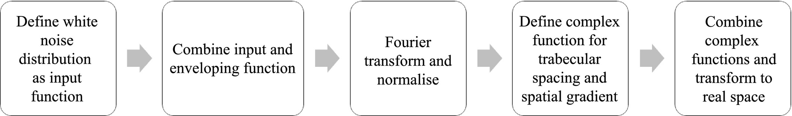

# ModelTrabecularBone
Tool for the creation of 3D synthesized trabecular bone structures within the human knee. There are eight tools in total, namely: the epiphysis, metaphysis and whole bone of both the distal femur and proximal tibia, the whole proximal fibula and the patella. The code was based on the simple, numerical model created by Peña-Solórzano et al. [1]. This paper discussed two different models, creating both concentric trabecular structures as well as non-concentric, linear ones. After doing a study on the effect of the model parameters on the morphology of the trabecular bone, these model parameters were fine-tuned for all eight regions. 

## Overview of the model
In order to keep the degree of spatial randomness associated with trabecular bone, the synthetic model starts from a spatially random function, more precisely a 2D array of white noise. In order to incorporate a first length scale (proportional to the mean trabecular thickness), the input white noise is combined with an enveloping function. The enveloping functions discussed in the paper are the ones with a Gaussian (for concentric structures) and Lorentzian (for non-concentric, linear structures) distribution. This point-wise product between the white noise and the enveloping function is then Fourier transformed over horizontal and transverse pixel coordinates in order to yield a speckle distribution with a tunable characteristic spacing. The Fourier filtered noise map is then normalized and shaped by a deterministic, complex background function in order to incorporate the directionality associated with trabecular bone. This background function is elliptical in the case of concentrix structures and one with a simple spatial gradient for the non-concentric ones. Lastly, the model undergoes a simple power-law transformation with which the model is transformed into real space. The associated power is once again a tunable parameter and allows for the introduction of a difference between the wall thickness and the pore thickness. The workflow just described is summarized in figure 1.

<!--
Figure 1. Workflow of the simple numerical model for synthesizing trabecular bone distributions by Peña-Solórzano et al. [1].

The model thus creates square maps of trabecular structures. In order get these structures fitted to the actual bone, a binary mask is needed to just cut the necessary region. These mask files should be in .bmp format. An overview of this masking is given in figure 2.

<!--
Figure 1. Overview of how the masking works, with on the left the created trabecular structure map, in the middle the binary mask and on the right the final resulting slice.

## Required packages
* numpy
* cv2 (OpenCV)
* maplotlib.pyplot

## Running the tool
The trabecular bone model tool for concentric structures can be called in the terminal using following input:  
'python model_trabecular_bone.py <"link to mask folder"> <"link to output folder"> <"bone"> <degree> <offset_q0> <offset_r0> <"plot">'

and for the non-concentric, linear structures using following input:  
'python model_trabecular_bone.py <"link to mask folder"> <"link to output folder"> <"bone"> <degree> <"plot">'

For the 'bone' input, the options are "patella" for the non-concentric structures and "proximal fibula", "whole proximal tibia", "epiphysis proximal tibia", "metaphysis proximal tibia", "whole distal femur", "epiphysis distal femur" or "metapysis distal femur" for the concentric structures. Note that the "" have to be added in order for the code to work. As for the 'plot' input, this should be "True" if you want to see a preview of the created structures and "False" if you want to create the structures for all slices to be saved in the output folder. Also note that a 'mask' folder will be created in the output folder. This is for the use of CTAn (software CT Analyzer, Bruker) when performing a 3D analysis.

An example of an input for concenctric structures is the following:  
'python model_trabecular_bone.py "C:\Users\..." "C:\Users\..." "epiphysis proximal tibia" 60 30 30 "True"'

## Citing
|||
|-----------------------|-----------------|
|**Author / Master Student** | Emma Van Riet| 
|**Author / PhD Candidate** | Karen Merken|
|**P.I.**| Hilde Bosmans |
|**Department** | Medical Physics & Quality Assesment, Radiology|
|**Institution** | KU Leuven |

## References
[1] C. A. Peña-Solórzano, D. W. Albrecht, D. M. Paganin, P. C. Harris, C. J. Hall, R. B. Bassed, and M. R. Dimmock, “Development of a simple numerical model for trabecular bone structures,” Medical Physics, vol. 46, no. 4, pp. 1766–1776, 2019. _eprint: https://onlinelibrary.wiley.com/doi/pdf/10.1002/mp.13435.
